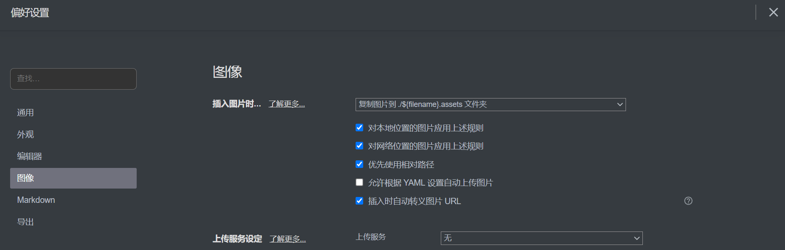

# 北京邮电大学本科招生宣传（非官方）

## 如何参与到编辑中？

### 欢迎你的参与！

**请不要害怕**，参加编写此项目**不需要**您有任何的前端常识，您需要做的只是编辑 Markdown 文件而已。
当您提交 Pull Request 并通过后，网站的构建将会自动完成，不需要您本地搭建环境。

> ? 这是如何实现的
> → 当此仓库的 main 分支被 push 时，将会
>
> 1.  通过 webhook 通知 cloudflare pages(下称 cfpages)
> 2.  cfpages 将会拉取本仓库的 main 分支
> 3.  cfpages 服务器进行构建 (`vuepress build`)
> 4.  cfpages 然后将构建好的静态文件（位于`.vuepress/dist`）经由 cloudflare 分发
>
> 这所有的操作都是自动的

### 文档与图片组织

- 为了方便理解，所有的文档和文件都放在根目录下。
- **对任何文件（主要是图片）的引用请使用相对引用（以`./`开头）**，这是Vuepress的限制，否则无法正确显示。
  - 援引的图片请放到`<对应的Markdown文件名>.assets`文件夹下，Typora可以在设置后自动完成这一点，您只需要粘贴图片即可。
    
  - **<u>此外，您还需要将每个图片的引用前加上`./`</u>**
    - 粘贴后的路径例子：``
    - 请手动改成：``

- 如果您是前端开发者，想要实现一些进阶操作（如在Markdown中引入和嵌入Vue组件），请参阅 [Vuepress 官方文档](https://www.vuepress.cn/)。